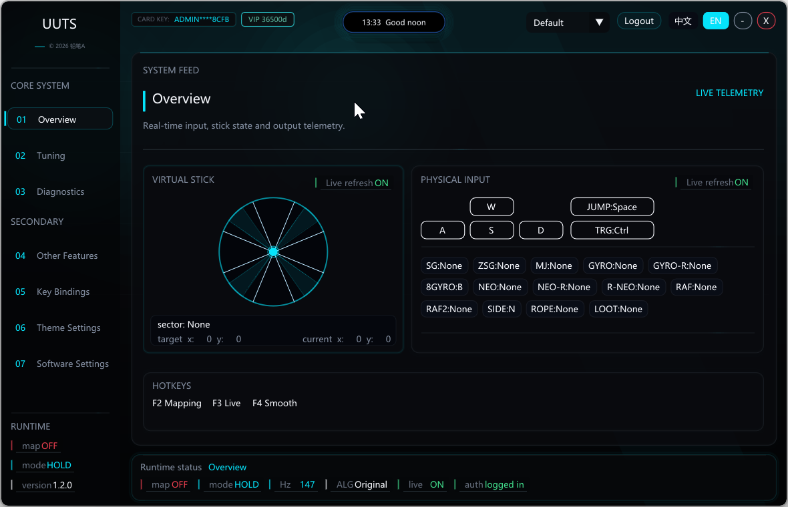
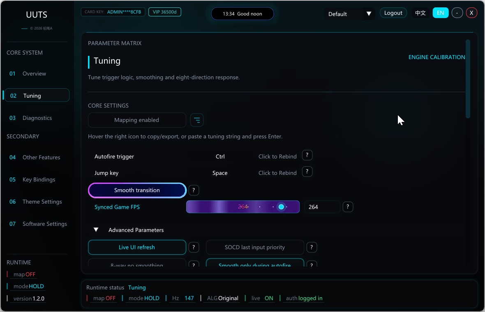

# imgui-onguoin

## 简介 / Introduction

`imgui-onguoin` 是由 onguoin 创建并维护的 Dear ImGui UI kit。它把主题配方、动态背景、字段控件、表面/卡片、布局辅助、绘制特效和高层语义组件整理成一套可复用的 C++ 库，供 Dear ImGui 应用直接组合使用。

`imgui-onguoin` is a Dear ImGui UI kit created and maintained by onguoin. It packages theme recipes, animated backgrounds, fields, surfaces/cards, layout helpers, drawing effects, and higher-level semantic widgets into a reusable C++ library for Dear ImGui applications.

这个仓库只包含通用 UI kit 和公开 demo，不包含私有产品逻辑、服务集成、授权流程、业务工作流或私有品牌资产。

This repository contains only the reusable UI kit and public demo code. It does not include private product logic, service integrations, authorization flows, business workflows, or private brand assets.

## 界面预览 / UI Preview

以下截图来自使用 `imgui-onguoin` 构建的 UUTS 软件项目界面，用于展示这套 UI kit 在真实桌面工具中的成品视觉效果。本仓库只开源通用 UI kit，不包含 UUTS 的私有业务逻辑、服务集成或产品专用代码。

The screenshots below are from the UUTS software interface built with `imgui-onguoin`. They show the finished visual style of this UI kit in a real desktop tool. This repository only open-sources the reusable UI kit and does not include UUTS private business logic, service integrations, or product-specific code.

**Overview / 总览**



**Tuning / 调参**



## 归属 / Ownership

`imgui-onguoin` 原始源码版权归 onguoin 所有，Copyright (c) 2026 onguoin，并以 MIT License 发布。

The original `imgui-onguoin` source code is copyright (c) 2026 onguoin and is released under the MIT License.

MIT License 允许他人使用、修改、分发、再授权和销售本软件的副本，但不会转移原始作品的版权归属。重新分发本项目或其实质部分时，必须保留版权声明和许可证文本。

The MIT License grants broad permission to use, modify, distribute, sublicense, and sell copies of the software, but it does not transfer ownership of the original work. Keep the copyright notice and license text when redistributing this project or substantial portions of it.

项目名称、Logo 和相关品牌标识不因 MIT License 自动授权为商标使用。

Project names, logos, and related branding are not granted as trademarks by the MIT License.

## 仓库内容 / What Is Inside

- 可复用的 `imgui_onguoin` CMake library target。
- A reusable `imgui_onguoin` CMake library target.
- 位于 `src/ui/imgui_onguoin*.h` 的公开头文件。
- Public headers under `src/ui/imgui_onguoin*.h`.
- 主题、调色板、动画节奏、布局、字段、背景、表面和组件模块。
- Theme, palette, motion, layout, field, background, surface, and widget modules.
- Windows 平台上的 Win32 + DirectX 11 demo target。
- A Win32 + DirectX 11 demo target on Windows.
- MIT 许可证、第三方依赖说明和贡献说明。
- MIT license, third-party dependency notes, and contribution rules.

## 不包含 / What Is Not Inside

- Dear ImGui 源码。
- Dear ImGui source code.
- 私有产品业务逻辑。
- Private product business logic.
- 产品专用文案、页面或工作流。
- Product-specific labels, pages, or workflows.
- 服务集成、授权系统或自动化逻辑。
- Service integrations, authorization systems, or automation logic.
- 私有产品品牌资产。
- Private product brand assets.

## Dear ImGui 依赖 / Dear ImGui Dependency

本仓库不内置 Dear ImGui。你可以让 CMake 默认通过 `FetchContent` 下载 Dear ImGui，也可以通过 `-DIMGUI_DIR=...` 指向你自己的本地 Dear ImGui 源码目录。

This repository does not vendor Dear ImGui. You can let CMake download Dear ImGui through `FetchContent`, which is the default, or pass `-DIMGUI_DIR=...` to use your own local Dear ImGui source checkout.

Dear ImGui 是独立项目，由 Omar Cornut 以 MIT License 发布。更多信息见 [THIRD_PARTY_NOTICES.md](THIRD_PARTY_NOTICES.md)。

Dear ImGui is a separate project licensed under the MIT License by Omar Cornut. See [THIRD_PARTY_NOTICES.md](THIRD_PARTY_NOTICES.md).

## 构建 / Build

要求：

Requirements:

- CMake 3.20 或更新版本。
- CMake 3.20 or newer.
- C++17 编译器。
- A C++17 compiler.
- 构建随仓库提供的 Win32/DX11 demo 时，需要 Windows 和 Visual Studio 2022 Build Tools。
- Windows and Visual Studio 2022 Build Tools are required for the bundled Win32/DX11 demo.

使用自动下载的 Dear ImGui 构建：

Build with automatic Dear ImGui download:

```powershell
cmake -S . -B build -G "Visual Studio 17 2022" -A x64
cmake --build build --config Release
```

使用已有 Dear ImGui 源码目录构建：

Build using an existing Dear ImGui checkout:

```powershell
cmake -S . -B build -G "Visual Studio 17 2022" -A x64 -DIMGUI_DIR="D:\path\to\imgui"
cmake --build build --config Release
```

Windows demo 可执行文件会生成在：

The Windows demo executable is created at:

```text
build/dist/imgui_onguoin_demo.exe
```

只构建库、不构建 demo：

Library-only configuration:

```powershell
cmake -S . -B build-lib -DIMGUI_ONGUOIN_BUILD_DEMO=OFF -DIMGUI_DIR="D:\path\to\imgui"
cmake --build build-lib --config Release
```

## CMake 使用方式 / CMake Usage

在父级 CMake 工程中使用：

From a parent CMake project:

```cmake
add_subdirectory(path/to/imgui-onguoin)

target_link_libraries(your_app PRIVATE
    imgui_onguoin::imgui_onguoin
)
```

`imgui-onguoin` 期望工程中已有名为 `imgui` 的 Dear ImGui target；如果没有，它会从 `IMGUI_DIR` 或 FetchContent 创建一个。

`imgui-onguoin` expects a Dear ImGui target named `imgui`; if one does not already exist, it creates one from `IMGUI_DIR` or FetchContent.

## 仓库结构 / Repository Layout

```text
src/ui/                      公开头文件和库源码 / Public headers and library sources
src/main.cpp                 Windows demo 应用 / Windows demo application
CMakeLists.txt               库和 demo 构建脚本 / Library and demo build
LICENSE                      imgui-onguoin 的 MIT 许可证 / MIT license for imgui-onguoin
THIRD_PARTY_NOTICES.md       依赖许可证说明 / Dependency license notes
CONTRIBUTING.md              贡献和归属规则 / Contribution and ownership rules
docs/PROJECT_INTRO.md        发布用中英文简介 / Bilingual release and repository intro
docs/assets/                 README 预览图片 / README preview images
```

## 许可证 / License

`imgui-onguoin` 使用 MIT License 发布，见 [LICENSE](LICENSE)。

`imgui-onguoin` is licensed under the MIT License. See [LICENSE](LICENSE).
